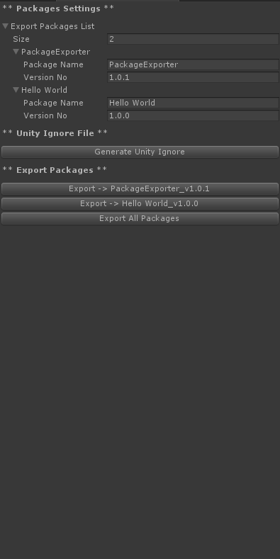

[](https://travis-ci.com/jcs090218/UnityPackageExporter)
[](https://unity3d.com/get-unity/download/archive)
[](https://github.com/jcs090218/UnityPackageExporter/releases/latest)
[](https://opensource.org/licenses/MIT)


# Unity Package Exporter

Export multiple packages by just one click, with no need to 
uncheck the assets.

<p align="center">
  
</p>


## How to use?

### 1. Import Package
You will need to import the package to your project. The package 
can be download from [here](https://github.com/jcs090218/UnityPackageExporter/releases).

### 2. Start using Package Exporter Window
You can start the `PackageExporter` window from the menu bar `PackageExporter`.

### 3. Fill package info and generate `.unityignore` file


After you fill the info, then hit `Generate Unity Ignore` button.

### 4. Edit `.unityignore` file
All the `.unityignore` files can be found under `PackageExporter/unityignore`
directory. 

### 5. Export...
Once the `.unityignore` file is generated, the according package 
export button should appear.

### 6. Enjoy! ###
Now you can manage as many packages you want to export!


## Unityignore Example
Generated `.unityignore` file for `Hello World` package.
```
# 
# Thank you for using 'Unity Package Exporter'. This is the generated 
# unityignore file.
# 
# Package Name: Hello World
# Version: 1.0.0
# Creation Date: 2017-10-25 06:58:14 
# 
# Package Link: https://github.com/jcs090218/UnityProjectExporter
# Author: Shen, Jen-Chieh
# Email: jcs090218@gmail.com
# 

# Ignore this plugin itself.
ProjectExporter

```


## Exporting
Export the package `Hello World`.
<p>
  
</p>
