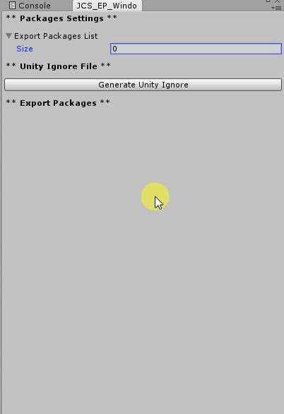

# JCSUnity_PE #

[](https://travis-ci.com/jcs090218/JCSUnity_PE)
[](https://opensource.org/licenses/MIT)

Unity Package Exporter - Export Unity package without needs to select the items 
you want to export, simplify the way of exporting unity package's process. 
Support export multiple packages at a time, and an analogous to gitignore in 
git package management.<br/><br/>

### Acknowledge ###

This is a small plugin for people who have multiple projects in one 
Unity project or people who need to export there tools. The goal of this project is to stop using 
Unity default export package system because people will have to 
manually choose what assets to export and what assets not to export. 
The idea behind this plugin is to do it once and never have to 
worry again.

### Tutorials ###

Once you open JCSUnity PE editor window then you can start manage
your packages. After you enter you package name and version number
(optional) then you can generate the unityignore file. <br/><br/>

<br/><br/>

Here is an example of the unityignore file. All the unityignore file 
will be generated under 'Assets/JCSUNity_PE/unityignore/' folder. 
in this example "JCSUnity_PE" would be ignored, and not added to 
the exported package.
<br/><br/>
```
# 
# Thank you for using 'JCSUnity Packages Exporter'. This is the generated 
# unityignore file.
# 
# Package Name: Hello World
# Version: 1.0.0
# Creation Date: 2017-10-25 06:58:14 
# 
# Package Link: https://github.com/jcs090218/JCSUnity_PE
# Author: Shen, Jen-Chieh
# Email: jcs090218@gmail.com
# 

# Ignore this plugin itself.
JCSUnity_PE

```
<br/>

When you click the corresponding export package button, the plugin 
will find the corresponding unityginore folder, and exclude all 
unityignore files. This is similar to .gitignore files used in Git.
<br/><br/>

<br/><br/>
