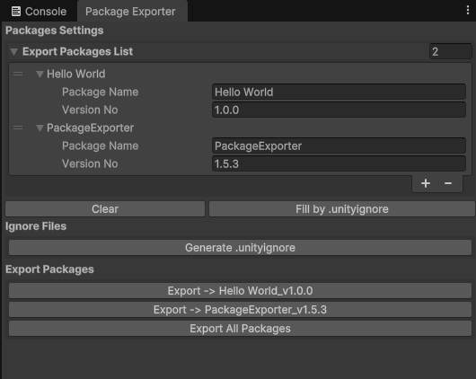
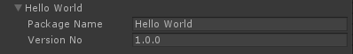

[](https://opensource.org/licenses/MIT)
[](https://unity3d.com/get-unity/download/archive)

# Package Exporter

[](https://github.com/Pixisoft/PackageExporter/actions/workflows/license.yml)
[](https://github.com/Pixisoft/PackageExporter/actions/workflows/source_build.yml)
[](https://github.com/Pixisoft/PackageExporter/actions/workflows/source_package.yml)
[](https://github.com/Pixisoft/PackageExporter/actions/workflows/publish_build.yml)
[](https://github.com/Pixisoft/PackageExporter/actions/workflows/publish_package.yml)

Export multiple packages by just one click, with no need to uncheck the assets.

<p align="center">
  
</p>

This package is a packaging (exporting) tool for Unity package system. It
allows you to export multiple packages with different contents.

*P.S. Notice this package will only work in Editor, and does not expect user
to use it in production builds.*

## 📁 Project Structures

* `Source` - Project contains plugin's source code.
* `Compile` - Project compiles source to DLL, it will link `_references` DLLs.
* `_references` - Unity DLL to compile project source to DLL.
* `Publish` - Project that contains package DLL and ready to publish to [Asset Store Publisher](https://publisher.assetstore.unity3d.com/info.html?_gl=1*1fwg1ij*_ga*MTg0NjU4MTc4NC4xNjAwMzQ5NzM3*_ga_1S78EFL1W5*MTYyNDI3MzU4Ni40Ni4wLjE2MjQyNzM1ODYuNjA.&_ga=2.77544981.1416380940.1624186429-1846581784.1600349737) portal.

## 🏆 Features

* Export multiple packages in a project
* Export method similar to `.gitignore` (easy for coder)
* Lightweight, no other dependencies
* Clean, no files are generated
* Highly compatible to any Unity version

## 🔨 How to use?

Here explains how you use this package correctly.

### 🔍 Step 1. Import Package

You will need to import the package to your project. The package
can be download from [here](https://github.com/Pixisoft/PackageExporter/releases).

### 🔍 Step 2. Start using Package Exporter Window

You can start the `PackageExporter` window from the menu bar `PackageExporter`.

### 🔍 Step 3. Fill package info and generate `.unityignore` file



After you fill the info, then hit `Generate Unity Ignore` button.

### 🔍 Step 4. Edit `.unityignore` file

All the `.unityignore` files can be found under `PackageExporter/unityignore`
directory.

### 🔍 Step 5. Export...

Once the `.unityignore` file is generated, the according package
export button should appear.

### 🎉 Done, and Enjoy! 🥳

Now you can manage as many packages you want to export! 🎉

## `.unityignore` File Example

Generated `.unityignore` file for `Hello World` package.

```
#
# Thank you for using `Package Exporter`. This is the generated
# unityignore file.
#
# Package Name: Hello World
# Version: 1.0.0
# Creation Date: 2017-10-25 06:58:14
#
# Package Link: https://github.com/Pixisoft/PackageExporter
# Author: Shen, Jen-Chieh
# Email: pixisoft.tw@gmail.com
#

# Ignore this plugin itself.
ProjectExporter

```

## 🚀 Exporting

Export the package `Hello World`.

<p>
  
</p>

## 🖥️ Batch Mode

You can export package by using Unity's batch mode.

| Method                             | Arguments                        | Details                             |
|:-----------------------------------|:---------------------------------|:------------------------------------|
| `PackageExporter.BatchMode.Export` | `_name`, `_version`, `_savePath` | Export package by unityignore name. |

| Command     | Optional | Details                                                          |
|:------------|:--------:|:-----------------------------------------------------------------|
| `_name`     | ❌       | Name of the exported package listed under unityignore directory. |
| `_version`  | ❌       | Version of the exported package.                                 |
| `_savePath` | ❌       | Where to save the exported package.                              |

For example,

```
$UNITY_PATH -batchmode -quit -projectPath "." -executeMethod PackageExporter.BatchMode.Export _name "Hello World" _version "0.1.0" _savePath "."
```

The `$UNITY_PATH` is the path to Unity executable hence it depends on variant OS.

On macOS,

```
/Applications/Unity/Unity.app/Contents/MacOS/Unity
```

On Windows,

```
"C:\Program Files\Unity\Editor\Unity.exe"
```

For more information, see [Command line arguments](https://docs.unity3d.com/Manual/CommandLineArguments.html).

## 📝 Todo List

- [ ] Support ingore extension syntax. (*.meta)

## ❓ FAQ

#### 💫 Why should I use this package?

This is often use when you have multiple target to export but it's hard to
memorize all contents to export for each packages. This tool resolve these
issues, and provides a method similar to Git (Source Control) ignore system.

#### 💫 Should I commit .unityignore files to source control?

If you wish to share package export settings then yes, you should include
`.unityignore` files to repository. Other than that, the answer would be no.

## License

Copyright (c) Pixisoft. All rights reserved.

Licensed under MIT. See [LICENSE.txt](https://github.com/Pixisoft/PackageExporter/blob/master/LICENSE.txt) for details.
